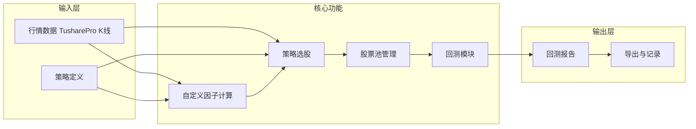

# 量化交易系统 - 产品设计（定稿版）

> 基于脑暴版整理，已确认选项均已定稿。2025-02 脑暴结论已合并。

---

## 一、产品定位与目标

- **核心目标**：验证策略是否 OK，通过「选股 → 管理 → 回测」形成闭环。
- **边界**：前期不接入实盘，聚焦策略研发与回测验证；实盘接口预留扩展点即可。
- **用户角色**：策略研究者 / 个人量化交易者（单用户即可，多用户可后续加权限）。

---

## 二、功能模块总览



---

## 三、模块详细设计

### 3.1 策略选股

| 维度 | 设计要点 |
|------|----------|
| **选股依据** | 技术指标（均线、MACD、RSI、量价等）、**自定义因子**、数值条件（如 5 日涨幅 > 10%）；MVP 仅 K 线，基本面 V2 |
| **自定义因子** | 支持用户定义因子表达式；**支持多因子组合**（如 `factor_A * 0.6 + factor_B * 0.4`）；因子可参与条件筛选或排序取 TopN；**支持用户保存到库**（FactorDef） |
| **选股方式** | 表单式条件筛选器（多条件与/或组合）+ 因子选股（按因子排序取前 N 只） |
| **选股范围** | 全市场、指定股票池、指定行业、排除项（ST 等）；MVP 不包含指数成分股、自定义代码列表、市值范围、上市时间 |
| **输出** | 选股结果列表（代码、名称、选股日、因子值、满足的条件摘要），可一键加入指定股票池 |

**已定**：支持自定义因子 + 多因子组合；数据范围先做 A 股。

### 3.2 股票池管理

| 维度 | 设计要点 |
|------|----------|
| **池子类型** | 手动自选池、策略选股结果池、自定义多池 |
| **池内信息** | 股票代码、名称、加入时间、来源、备注 |
| **标记** | 标签（多标签：如「观察中」「已回测」「待买」） |
| **记录** | 对单只股票可写「观察记录」（时间 + 文本） |
| **池子版本/快照** | **支持**：按「基准日期」保存快照，用于回测「某日当时池内有哪些股」；快照列表、按快照查股票 API 进 MVP；复盘视图 V2 |

### 3.3 回测模块

| 维度 | 设计要点 |
|------|----------|
| **回测对象** | 单股、多股/股票池；**MVP 仅等权**，自定义权重 V2；支持某日快照作为标的 |
| **策略逻辑** | 内置模板（双均线、突破、固定持仓）+ **自定义买卖规则**（表单配置，DSL V2） |
| **止损止盈** | MVP 支持：固定比例 + ATR 倍数 |
| **执行方式** | 异步任务；SQLite + 后台线程（无 Celery/Redis）；提交返回 task_id，轮询 status 取 result |
| **绩效指标** | 总收益、年化、最大回撤、夏普、胜率、盈亏比、交易次数 |
| **输出** | 收益曲线图、回撤图、交易明细表、绩效指标卡片；支持导出 CSV |

**已定**：回测引擎 backtrader；前端渲染结果；参数优化 V2；基准叠加 V2。

---

## 四、技术架构（已定）

| 层级 | 技术选型 | 说明 |
|------|----------|------|
| 前端 | React + Ant Design + Vite | 表格/表单/图表丰富，量化看板适配 |
| 后端 | Python + FastAPI | REST API、回测引擎、因子计算 |
| 回测引擎 | backtrader | 成熟、指标多、文档全 |
| 任务队列 | SQLite + 后台线程 | 异步回测任务，无 Celery/Redis，重启可恢复 |
| 数据源 | Tushare Pro | 数据适配层封装，MVP 仅 K 线 |
| 存储 | SQLite | 行情、股票池、策略配置、回测结果 |

**数据闭环**：回测完全依赖本地已同步数据，不依赖外部接口。

---

## 五、MVP 范围

**包含**：日线行情 + A 股列表、因子（预置模板 8+ 个 + 表达式 + 多因子组合 + 用户保存）、选股（表单式、范围：全市场/池子/行业/排除项）、股票池（含快照）、回测（内置模板 + 表单自定义规则 + 止损止盈、异步）、报告渲染 + 导出 CSV + PDF 报告。

**不做进 MVP**：实盘接口、参数优化、分钟级回测、复杂仓位与风控、多用户与权限、基本面数据、指数成分股、DSL 策略、基准叠加、自定义权重、复盘视图、Word 报告。

---

## 六、核心数据模型

```mermaid
erDiagram
  StockPool ||--o{ PoolSnapshot : has
  StockPool ||--o{ PoolStock : contains
  PoolStock ||--o{ StockRecord : has
  FactorDef ||--o{ SelectResult : used_in
  SelectResult ||--o{ SelectStock : contains
  BacktestTask ||--o{ BacktestTrade : produces
  BacktestTask ||--|| BacktestMetrics : has

  StockPool { string id string name string type }
  PoolSnapshot { string id string pool_id date snapshot_date }
  PoolStock { string id string pool_id string stock_code date added_at }
  FactorDef { string id string name string expression }
  BacktestTask { string id string pool_id string snapshot_id json strategy_params date start_date end_date }
  BacktestMetrics { float total_return float sharpe float max_drawdown }
```

---

## 七、后端 API 定稿

| 模块 | 方法 | 路径 | 说明 |
|------|------|------|------|
| 数据 | GET | /api/stocks | 股票列表（分页、关键词、行业筛选） |
| 数据 | POST | /api/data/sync | 同步 stock_basic / daily；支持增量同步 |
| 因子 | GET | /api/factors/templates | 预置因子模板列表 |
| 因子 | GET | /api/factors | 用户自定义因子列表（FactorDef） |
| 因子 | POST | /api/factors/calc | 计算因子值 |
| 选股 | POST | /api/select/run | 执行选股，返回候选列表 |
| 股票池 | CRUD | /api/pools | 池子增删改查 |
| 股票池 | POST | /api/pools/{id}/snapshot | 创建快照 |
| 股票池 | GET | /api/pools/{id}/snapshots | 快照列表 |
| 股票池 | GET | /api/pools/{id}/snapshots/{snapshot_id}/stocks | 某快照的股票列表 |
| 股票池 | GET | /api/pools/{id}/stocks | 池内股票列表（当前） |
| 回测 | GET | /api/backtest/strategies | 内置策略 + 自定义规则配置项 |
| 回测 | POST | /api/backtest/run | 提交回测任务，返回 task_id |
| 回测 | GET | /api/backtest/{id}/status | 任务状态（轮询） |
| 回测 | GET | /api/backtest/{id}/result | 获取回测结果 |

---

## 八、自定义买卖规则（表单配置）

| 类型 | 示例 |
|------|------|
| 价格条件 | close > ma(20), high > hhv(20) |
| 指标条件 | rsi < 30, macd > 0 |
| 量能条件 | volume > ma(5, vol) |
| 逻辑组合 | (cond1 and cond2) or cond3 |
| 仓位 | 固定 30%、等权分仓 |
| 止损止盈 | 固定比例（如 -5%/+10%）、ATR 倍数 |

**field 支持**：close, high, low, open, volume, ma(n), rsi, macd, hhv(n), llv(n), pct_change 等。

**JSON 结构**：`{ buy: [...], sell: [...], logic: "and", position: { type, value }, stop_loss?: {...}, take_profit?: {...} }`

---

## 九、页面结构与导航

- **侧边栏**：数据 / 选股 / 股票池 / 回测 四块
- **仪表盘**：MVP 简化版（池子数量、最近选股/回测记录）；完整图表 V2
- **路由**：`/` 仪表盘，`/data/stocks`、`/data/sync`，`/select`，`/pools`、`/pools/:id`，`/backtest`、`/backtest/:id`

---

## 十、因子模板（MVP 8+ 个）

| 模板 ID | 名称 | 参数 |
|---------|------|------|
| momentum_5d | 5日动量 | - |
| momentum_20d | 20日动量 | - |
| reversal_5d | 5日反转 | - |
| volatility_20d | 20日波动率 | - |
| ma_cross | 均线乖离 | n |
| volume_ratio | 量比 | - |
| rsi | RSI | period |
| macd | MACD | - |
| turnover | 换手率 | - |

---

## 十一、数据同步与错误处理

**数据同步**：UI 提示「全市场同步较慢，建议先选标的」；支持增量同步（只拉本地缺失日期）。

**错误响应**：`{ code, message, detail? }`；细错误码枚举（如 1001=token 缺失），便于前端 i18n。

**日志**：落盘 `logs/app.log`；TimedRotatingFileHandler 按天轮转，保留 7 天；INFO 记录关键操作，ERROR 记录异常堆栈。

---

## 十二、导出与报告

**CSV 导出**：选股结果、交易明细、净值序列、池内股票。

**PDF 报告**：MVP 支持；包含曲线图、指标表、交易明细；引入报告模板与渲染库（如 WeasyPrint 或 reportlab）。

---

## 十三、实现顺序（Phase 划分）

1. **Phase 1 - 基础**：项目骨架 + Tushare 数据适配层 + 本地缓存 + 股票列表 API
2. **Phase 2 - 选股**：因子模板 + 表达式解析 + 选股 API + 选股结果入池
3. **Phase 3 - 股票池**：池子 CRUD + 快照（含列表、按快照查股票 API）+ 标签/记录
4. **Phase 4 - 回测**：backtrader 引擎 + 策略模板 + 异步任务（SQLite 队列）+ 回测 API
5. **Phase 5 - 前端**：各模块页面 + 仪表盘简化版 + 回测结果渲染 + PDF 报告 + 联调
