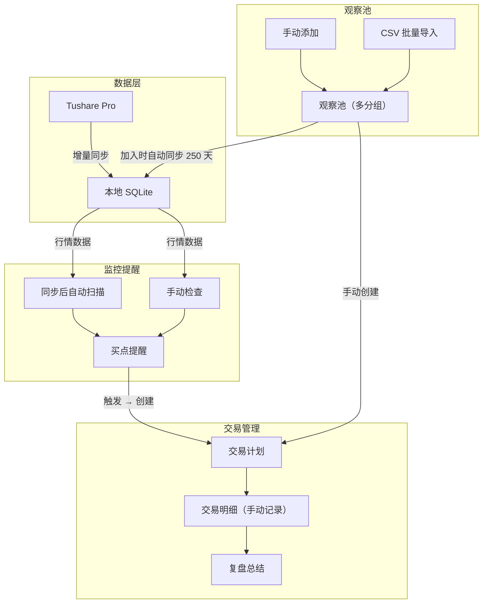
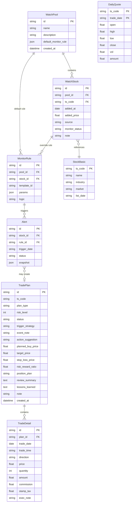

# 量化交易系统 - 产品设计（定稿版）

> 2026-03 重新定稿。产品方向从「选股→回测」调整为「选股→监控→交易计划→执行→复盘」的交易工作流管理。

---

## 一、产品定位与目标

- **核心场景**：通过灵活的策略选股，将标的加入观察池，监控买点并提醒，制定交易计划，手动记录交易，最终复盘总结。
- **核心价值**：
  - 每笔交易都有清晰的「为什么做」（触发策略、热点事件）
  - 每笔交易都有完整的「结果如何」（复盘、经验教训）
- **边界**：V1 不接入实盘，不做回测引擎，不做 AI 选股；聚焦交易工作流管理。
- **用户角色**：个人量化交易者 / 策略研究者（单用户）。

---

## 二、V1 / V2 范围划分

### V1（MVP）

1. 观察池（多分组、单个添加 + CSV 批量导入）
2. 数据同步（仅观察池中股票，Tushare Pro，日线行情）
3. 监控提醒（6 个预置模板 + 自定义组合，系统内提醒）
4. 交易计划（创建、管理、关联交易明细、复盘）
5. 交易明细（手动记录）

### V2

- AI 工作流驱动选股（一键导入观察池）
- 回测模块
- 微信 / 钉钉 webhook 推送提醒
- 周期性复盘报告（周报 / 月报）
- PDF 导出
- 实盘接口

---

## 三、整体工作流

---

## 四、模块详细设计

### 4.1 观察池

#### 观察池（分组）字段

| 字段 | 说明 |
|------|------|
| 名称 | 如「短线池」「趋势跟踪」 |
| 描述 | 可选，简要说明用途 |
| 默认监控条件 | 池子级别的默认买点规则，新加入的股票自动继承 |
| 股票数量 | 自动统计 |
| 创建时间 | 自动 |

#### 池内股票字段

| 分类 | 字段 | 说明 |
|------|------|------|
| 基本信息 | 股票代码 | |
| | 股票名称 | 同步时自动填充 |
| | 所属观察池 | 分组关联 |
| | 加入日期 | 自动 |
| | 加入价格 | 可手动填 / 自动取最新收盘价 |
| | 加入来源 | 手动添加 / CSV 导入 / V2:策略选股 |
| 监控相关 | 监控状态 | 监控中 / 已暂停 / 已触发 |
| | 监控条件 | 继承池子默认，可单独覆盖 |
| 备注 | 备注 | 为什么关注这只股票 |

#### CSV 批量导入

- 灵活匹配：必填仅股票代码，其他列（价格、备注等）有就读没有就跳过
- 股票名称在同步时自动填充

---

### 4.2 数据同步

| 维度 | 设计 |
|------|------|
| 数据源 | Tushare Pro |
| 同步范围 | 仅观察池中的股票（股票基础信息 + 日线行情） |
| 增量同步 | 只拉本地缺失的日期 |
| 自动触发 | 股票加入观察池时自动拉取近 250 天历史数据 |
| 手动触发 | 支持手动点击同步 |
| 联动 | 数据同步完成后自动触发监控扫描 |

---

### 4.3 监控提醒

#### 预置监控模板（6 个）

| 模板 ID | 名称 | 逻辑说明 | 参数 |
|---------|------|----------|------|
| ma_support | 均线支撑 | 收盘价回踩 MA(N) 附近 | N（均线周期） |
| macd_golden | MACD 金叉 | DIF 上穿 DEA | - |
| rsi_oversold | RSI 超卖 | RSI 低于阈值 | 阈值（默认 30） |
| volume_shrink | 缩量回调 | 价格回调 + 成交量萎缩 | 回调幅度、量缩比例 |
| breakout_high | 突破新高 | 收盘价创 N 日新高 | N（天数） |
| price_threshold | 价格阈值 | 跌破指定价格（如加入价 × 95%） | 阈值比例 |

#### 自定义组合

- 支持多条件 AND / OR 组合
- 条件原子：字段 + 运算符 + 值/引用

#### 扫描与提醒

| 维度 | 设计 |
|------|------|
| 扫描触发 | 数据同步后自动扫描 + 随时手动触发 |
| 提醒方式 | V1：系统内消息列表 / 弹窗 |
| | V2：微信 / 钉钉 webhook 推送 |
| 监控继承 | 池子设置默认监控条件，股票可单独覆盖 |

---

### 4.4 交易计划

> 一个交易计划对应一只股票。

| 分类 | 字段 | 说明 |
|------|------|------|
| 基本信息 | 标的 | 股票代码 + 名称 |
| | 计划类型 | 趋势跟踪 / 短线操作 / 事件驱动 |
| | 风险等级 | 1-5 星 |
| | 计划状态 | 待触发 / 执行中 / 已完结 / 已取消 |
| | 创建时间 | 自动 |
| 交易逻辑 | 触发策略 | 关联选股记录（哪个策略 / 提醒触发的） |
| | 热点/事件 | 宏观背景、事件驱动原因 |
| | 操作建议 | 买入 / 加仓 / 观望 |
| | 备注 | 补充说明 |
| 价格目标 | 计划买入价 | |
| | 目标价 | |
| | 止损价 | |
| | 盈亏比 | 自动计算：(目标价 - 买入价) / (买入价 - 止损价) |
| 仓位 | 计划仓位 | 金额或比例 |
| 复盘 | 实际盈亏 | 从关联的交易明细自动汇总 |
| | 复盘总结 | 整体执行评价，结果是否符合预期 |
| | 经验教训 | 下次该改进什么 |

---

### 4.5 交易明细

> 手动添加，关联到交易计划。

| 分类 | 字段 | 说明 |
|------|------|------|
| 基本信息 | 成交日期 | |
| | 成交时间 | 可选 |
| | 方向 | 买入 / 卖出 |
| | 成交价格 | |
| | 成交数量 | 股 |
| | 成交金额 | 自动计算 |
| 费用 | 佣金 | 可选，可按比例自动算 |
| | 印花税 | 卖出时自动算 |
| 备注 | 执行备注 | 当时为什么在这个价位成交、判断依据 |

---

## 五、技术架构

| 层级 | 技术选型 | 说明 |
|------|----------|------|
| 前端 | React + TypeScript + Ant Design + Vite | 表格/表单/图表丰富 |
| 后端 | Python + FastAPI | REST API |
| 存储 | SQLite | 单用户足够，轻量 |
| 数据源 | Tushare Pro | 日线行情 + 股票基础信息 |
| 异步任务 | 后台线程 | 数据同步 + 监控扫描，无 Celery/Redis |

---

## 六、数据库设计

---

## 七、页面结构与导航

### 侧边栏（4 块）

1. 仪表盘
2. 观察池
3. 监控提醒
4. 交易计划

### 路由

| 路由 | 页面 | 内容 |
|------|------|------|
| `/` | 仪表盘 | 观察池概况、最新提醒、进行中的交易计划 |
| `/pools` | 观察池列表 | 所有分组一览 |
| `/pools/:id` | 池内详情 | 股票列表 + 添加/CSV导入 + 同步 + 监控状态 |
| `/alerts` | 监控提醒 | 提醒列表（待处理 / 已处理），可一键创建交易计划 |
| `/plans` | 交易计划列表 | 按状态筛选（待触发 / 执行中 / 已完结 / 已取消） |
| `/plans/:id` | 计划详情 | 交易逻辑 + 价格目标 + 关联交易明细 + 复盘总结 |

---

## 八、实施顺序（Phase 划分）

1. **Phase 1 - 基础骨架**：项目结构 + 数据库 + Tushare 适配层 + 股票基础信息
2. **Phase 2 - 观察池**：池子 CRUD + 池内股票管理 + CSV 导入 + 数据同步联动
3. **Phase 3 - 监控**：监控规则引擎 + 6 个模板 + 扫描任务 + 提醒列表
4. **Phase 4 - 交易**：交易计划 CRUD + 交易明细 + 复盘 + 盈亏汇总
5. **Phase 5 - 前端**：各模块页面 + 仪表盘 + 联调
