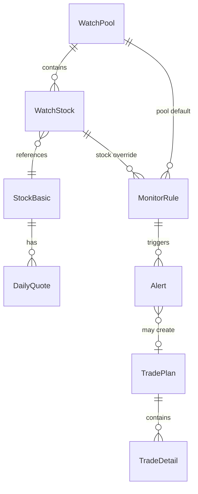
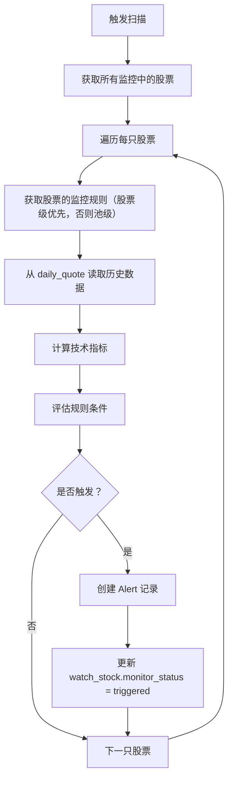

# 量化交易系统 - 技术方案

> 基于 `01-产品设计-定稿.md`（2026-03 版），涵盖项目结构、数据库详细设计、全量 API 接口、技术指标计算、异步任务机制。

---

## 一、项目结构

```
newQuant/
├── backend/
│   ├── app/
│   │   ├── __init__.py
│   │   ├── main.py              # FastAPI 入口、CORS、生命周期
│   │   ├── config.py            # 环境变量、路径配置
│   │   ├── database.py          # SQLAlchemy engine、session、init_db
│   │   ├── models/              # SQLAlchemy ORM 模型
│   │   │   ├── __init__.py
│   │   │   ├── stock.py         # StockBasic, DailyQuote
│   │   │   ├── pool.py          # WatchPool, WatchStock
│   │   │   ├── monitor.py       # MonitorRule, Alert
│   │   │   └── trade.py         # TradePlan, TradeDetail
│   │   ├── schemas/             # Pydantic 请求/响应模型
│   │   │   ├── __init__.py
│   │   │   ├── stock.py
│   │   │   ├── pool.py
│   │   │   ├── monitor.py
│   │   │   └── trade.py
│   │   ├── routers/             # API 路由
│   │   │   ├── __init__.py
│   │   │   ├── pools.py
│   │   │   ├── stocks.py
│   │   │   ├── sync.py
│   │   │   ├── monitor.py
│   │   │   ├── alerts.py
│   │   │   ├── plans.py
│   │   │   └── dashboard.py
│   │   ├── services/            # 业务逻辑
│   │   │   ├── __init__.py
│   │   │   ├── tushare_adapter.py
│   │   │   ├── sync_service.py
│   │   │   ├── monitor_engine.py
│   │   │   └── indicator.py     # 技术指标计算
│   │   └── tasks/               # 后台任务
│   │       ├── __init__.py
│   │       └── background.py    # 同步 + 扫描后台线程
│   ├── tests/
│   ├── requirements.txt
│   ├── .env.example
│   └── data/                    # SQLite 数据库文件
├── frontend/
│   ├── src/
│   │   ├── api/                 # API 客户端
│   │   ├── components/          # 通用组件
│   │   ├── pages/               # 页面
│   │   │   ├── Dashboard/
│   │   │   ├── Pools/
│   │   │   ├── Alerts/
│   │   │   └── Plans/
│   │   ├── layouts/             # 布局（侧边栏）
│   │   ├── hooks/               # 自定义 hooks
│   │   ├── types/               # TypeScript 类型
│   │   ├── App.tsx
│   │   └── main.tsx
│   ├── index.html
│   ├── vite.config.ts
│   ├── tsconfig.json
│   └── package.json
└── docs/
```

---

## 二、数据库详细设计

### 2.1 表结构

#### stock_basic — 股票基础信息

| 列名 | 类型 | 约束 | 说明 |
|------|------|------|------|
| ts_code | VARCHAR(16) | PK | Tushare 股票代码，如 000001.SZ |
| symbol | VARCHAR(10) | | 纯数字代码 |
| name | VARCHAR(32) | NOT NULL | 股票名称 |
| area | VARCHAR(16) | | 地区 |
| industry | VARCHAR(32) | | 行业 |
| market | VARCHAR(16) | | 市场（主板/创业板/科创板） |
| list_date | VARCHAR(8) | | 上市日期 YYYYMMDD |
| list_status | VARCHAR(2) | | L=上市 D=退市 P=暂停 |

#### daily_quote — 日线行情

| 列名 | 类型 | 约束 | 说明 |
|------|------|------|------|
| ts_code | VARCHAR(16) | PK | |
| trade_date | VARCHAR(8) | PK | YYYYMMDD |
| open | FLOAT | | 开盘价 |
| high | FLOAT | | 最高价 |
| low | FLOAT | | 最低价 |
| close | FLOAT | | 收盘价 |
| pre_close | FLOAT | | 昨收 |
| change | FLOAT | | 涨跌额 |
| pct_chg | FLOAT | | 涨跌幅（%） |
| vol | FLOAT | | 成交量（手） |
| amount | FLOAT | | 成交额（千元） |

#### watch_pool — 观察池（分组）

| 列名 | 类型 | 约束 | 说明 |
|------|------|------|------|
| id | VARCHAR(36) | PK | UUID |
| name | VARCHAR(64) | NOT NULL | 池子名称 |
| description | TEXT | | 描述 |
| default_monitor_rule | JSON | | 默认监控条件 |
| created_at | DATETIME | NOT NULL | 创建时间 |
| updated_at | DATETIME | NOT NULL | 更新时间 |

#### watch_stock — 池内股票

| 列名 | 类型 | 约束 | 说明 |
|------|------|------|------|
| id | VARCHAR(36) | PK | UUID |
| pool_id | VARCHAR(36) | FK → watch_pool.id | 所属池子 |
| ts_code | VARCHAR(16) | FK → stock_basic.ts_code | 股票代码 |
| added_at | DATETIME | NOT NULL | 加入日期 |
| added_price | FLOAT | | 加入价格 |
| source | VARCHAR(16) | NOT NULL | manual / csv / strategy |
| monitor_status | VARCHAR(16) | NOT NULL DEFAULT 'monitoring' | monitoring / paused / triggered |
| note | TEXT | | 备注 |
| created_at | DATETIME | NOT NULL | |

联合唯一约束：`(pool_id, ts_code)`

#### monitor_rule — 监控规则

| 列名 | 类型 | 约束 | 说明 |
|------|------|------|------|
| id | VARCHAR(36) | PK | UUID |
| pool_id | VARCHAR(36) | FK, NULLABLE | 池级规则关联池子 |
| stock_id | VARCHAR(36) | FK, NULLABLE | 股票级规则关联股票 |
| template_id | VARCHAR(32) | | 模板 ID（ma_support 等），自定义为 null |
| params | JSON | | 模板参数或自定义条件 |
| logic | VARCHAR(8) | DEFAULT 'and' | 多条件组合逻辑：and / or |
| is_active | BOOLEAN | DEFAULT true | 是否启用 |
| created_at | DATETIME | NOT NULL | |

约束：`pool_id` 和 `stock_id` 至少一个非空

#### alert — 提醒记录

| 列名 | 类型 | 约束 | 说明 |
|------|------|------|------|
| id | VARCHAR(36) | PK | UUID |
| stock_id | VARCHAR(36) | FK → watch_stock.id | 触发的观察池股票 |
| rule_id | VARCHAR(36) | FK → monitor_rule.id | 触发的规则 |
| ts_code | VARCHAR(16) | NOT NULL | 冗余，便于查询 |
| trigger_date | VARCHAR(8) | NOT NULL | 触发日期 |
| status | VARCHAR(16) | NOT NULL DEFAULT 'pending' | pending / processed / dismissed |
| plan_id | VARCHAR(36) | FK, NULLABLE | 关联创建的交易计划 |
| snapshot | JSON | | 触发时的行情快照 |
| created_at | DATETIME | NOT NULL | |

#### trade_plan — 交易计划

| 列名 | 类型 | 约束 | 说明 |
|------|------|------|------|
| id | VARCHAR(36) | PK | UUID |
| ts_code | VARCHAR(16) | NOT NULL | 股票代码 |
| stock_name | VARCHAR(32) | | 股票名称（冗余） |
| plan_type | VARCHAR(16) | NOT NULL | trend / short_term / event_driven |
| risk_level | INTEGER | NOT NULL DEFAULT 3 | 1-5 |
| status | VARCHAR(16) | NOT NULL DEFAULT 'pending' | pending / active / completed / cancelled |
| trigger_strategy | TEXT | | 触发策略描述 |
| alert_id | VARCHAR(36) | FK, NULLABLE | 关联的提醒 |
| event_note | TEXT | | 热点/事件背景 |
| action_suggestion | VARCHAR(16) | | buy / add_position / watch |
| planned_buy_price | FLOAT | | 计划买入价 |
| target_price | FLOAT | | 目标价 |
| stop_loss_price | FLOAT | | 止损价 |
| risk_reward_ratio | FLOAT | | 盈亏比（自动算） |
| position_plan | VARCHAR(32) | | 仓位计划 |
| actual_pnl | FLOAT | | 实际盈亏（从明细汇总） |
| review_summary | TEXT | | 复盘总结 |
| lessons_learned | TEXT | | 经验教训 |
| note | TEXT | | 备注 |
| created_at | DATETIME | NOT NULL | |
| updated_at | DATETIME | NOT NULL | |

#### trade_detail — 交易明细

| 列名 | 类型 | 约束 | 说明 |
|------|------|------|------|
| id | VARCHAR(36) | PK | UUID |
| plan_id | VARCHAR(36) | FK → trade_plan.id | 关联交易计划 |
| trade_date | VARCHAR(8) | NOT NULL | 成交日期 YYYYMMDD |
| trade_time | VARCHAR(8) | | 成交时间 HH:MM:SS |
| direction | VARCHAR(4) | NOT NULL | buy / sell |
| price | FLOAT | NOT NULL | 成交价格 |
| quantity | INTEGER | NOT NULL | 成交数量（股） |
| amount | FLOAT | NOT NULL | 成交金额（自动算） |
| commission | FLOAT | DEFAULT 0 | 佣金 |
| stamp_tax | FLOAT | DEFAULT 0 | 印花税 |
| exec_note | TEXT | | 执行备注 |
| created_at | DATETIME | NOT NULL | |

### 2.2 ER 关系总结



---

## 三、API 接口设计

### 3.1 观察池

| 方法 | 路径 | 说明 | 请求体/参数 | 响应 |
|------|------|------|-------------|------|
| GET | `/api/pools` | 观察池列表 | - | `Pool[]`（含 stock_count） |
| POST | `/api/pools` | 创建观察池 | `{ name, description?, default_monitor_rule? }` | `Pool` |
| GET | `/api/pools/:id` | 池子详情 | - | `Pool`（含 stock_count） |
| PUT | `/api/pools/:id` | 更新池子 | `{ name?, description?, default_monitor_rule? }` | `Pool` |
| DELETE | `/api/pools/:id` | 删除池子 | - | `204` |
| GET | `/api/pools/:id/stocks` | 池内股票列表 | `?keyword&monitor_status` | `WatchStock[]` |
| POST | `/api/pools/:id/stocks` | 添加单只股票 | `{ ts_code, added_price?, note? }` | `WatchStock` |
| POST | `/api/pools/:id/stocks/import` | CSV 批量导入 | `multipart/form-data: file` | `{ imported: N, skipped: N, errors: [] }` |
| DELETE | `/api/pools/:id/stocks/:stock_id` | 移除股票 | - | `204` |
| PUT | `/api/pools/:id/stocks/:stock_id` | 更新股票信息 | `{ note?, monitor_status? }` | `WatchStock` |

### 3.2 数据同步

| 方法 | 路径 | 说明 | 请求体/参数 | 响应 |
|------|------|------|-------------|------|
| POST | `/api/sync/pool/:pool_id` | 同步整个池子的行情数据 | `{ days?: 250 }` | `{ task_id }` |
| POST | `/api/sync/stock/:ts_code` | 同步单只股票 | `{ days?: 250 }` | `{ task_id }` |
| GET | `/api/sync/status/:task_id` | 查询同步任务状态 | - | `{ status, progress, message? }` |

同步完成后自动触发监控扫描。

### 3.3 监控规则

| 方法 | 路径 | 说明 | 请求体/参数 | 响应 |
|------|------|------|-------------|------|
| GET | `/api/monitor/templates` | 获取预置模板列表 | - | `Template[]` |
| GET | `/api/pools/:id/rules` | 池子的监控规则 | - | `MonitorRule[]` |
| POST | `/api/pools/:id/rules` | 为池子设置默认规则 | `{ template_id?, params, logic? }` | `MonitorRule` |
| GET | `/api/stocks/:stock_id/rules` | 单只股票的监控规则 | - | `MonitorRule[]` |
| POST | `/api/stocks/:stock_id/rules` | 为股票设置独立规则 | `{ template_id?, params, logic? }` | `MonitorRule` |
| PUT | `/api/monitor/rules/:rule_id` | 更新规则 | `{ params?, logic?, is_active? }` | `MonitorRule` |
| DELETE | `/api/monitor/rules/:rule_id` | 删除规则 | - | `204` |
| POST | `/api/monitor/scan` | 手动触发全量扫描 | `{ pool_id? }` | `{ task_id }` |
| POST | `/api/monitor/scan/:pool_id` | 手动触发指定池扫描 | - | `{ task_id }` |

### 3.4 提醒

| 方法 | 路径 | 说明 | 请求体/参数 | 响应 |
|------|------|------|-------------|------|
| GET | `/api/alerts` | 提醒列表 | `?status&ts_code&page&size` | `{ items: Alert[], total }` |
| GET | `/api/alerts/:id` | 提醒详情 | - | `Alert`（含 snapshot） |
| PUT | `/api/alerts/:id` | 更新提醒状态 | `{ status }` | `Alert` |
| POST | `/api/alerts/:id/create-plan` | 从提醒一键创建交易计划 | `{ plan_type?, ... }` | `TradePlan` |

### 3.5 交易计划

| 方法 | 路径 | 说明 | 请求体/参数 | 响应 |
|------|------|------|-------------|------|
| GET | `/api/plans` | 计划列表 | `?status&plan_type&page&size` | `{ items: Plan[], total }` |
| POST | `/api/plans` | 创建计划 | `TradePlanCreate` | `TradePlan` |
| GET | `/api/plans/:id` | 计划详情 | - | `TradePlan`（含 details, pnl_summary） |
| PUT | `/api/plans/:id` | 更新计划 | `TradePlanUpdate` | `TradePlan` |
| DELETE | `/api/plans/:id` | 删除计划 | - | `204` |
| PUT | `/api/plans/:id/review` | 提交复盘 | `{ review_summary, lessons_learned }` | `TradePlan` |

#### TradePlanCreate

```json
{
  "ts_code": "000001.SZ",
  "plan_type": "trend",
  "risk_level": 3,
  "trigger_strategy": "MACD 金叉触发",
  "alert_id": null,
  "event_note": "板块轮动到银行",
  "action_suggestion": "buy",
  "planned_buy_price": 10.5,
  "target_price": 12.0,
  "stop_loss_price": 9.8,
  "position_plan": "30%",
  "note": ""
}
```

### 3.6 交易明细

| 方法 | 路径 | 说明 | 请求体/参数 | 响应 |
|------|------|------|-------------|------|
| GET | `/api/plans/:id/details` | 计划下的交易明细 | - | `TradeDetail[]` |
| POST | `/api/plans/:id/details` | 添加交易明细 | `TradeDetailCreate` | `TradeDetail` |
| PUT | `/api/details/:id` | 更新明细 | `TradeDetailUpdate` | `TradeDetail` |
| DELETE | `/api/details/:id` | 删除明细 | - | `204` |

#### TradeDetailCreate

```json
{
  "trade_date": "20260301",
  "trade_time": "09:35:00",
  "direction": "buy",
  "price": 10.52,
  "quantity": 1000,
  "commission": 5.26,
  "exec_note": "开盘竞价买入，符合计划价位"
}
```

`amount`（成交金额）= price × quantity，后端自动计算。

`stamp_tax`（印花税）= 卖出时 amount × 0.05%，后端自动计算。

### 3.7 仪表盘

| 方法 | 路径 | 说明 | 响应 |
|------|------|------|------|
| GET | `/api/dashboard` | 仪表盘汇总 | `{ pool_summary, recent_alerts, active_plans }` |

#### 响应结构

```json
{
  "pool_summary": {
    "total_pools": 3,
    "total_stocks": 25,
    "monitoring_count": 20
  },
  "recent_alerts": [
    { "id": "...", "ts_code": "000001.SZ", "stock_name": "平安银行", "template_name": "MACD 金叉", "trigger_date": "20260228", "status": "pending" }
  ],
  "active_plans": [
    { "id": "...", "ts_code": "000001.SZ", "stock_name": "平安银行", "plan_type": "trend", "status": "active", "risk_reward_ratio": 2.14 }
  ]
}
```

---

## 四、监控引擎技术设计

### 4.1 技术指标计算

使用 pandas 基于 daily_quote 数据计算，每次扫描时动态计算：

| 指标 | 计算方式 | 依赖数据 |
|------|----------|----------|
| MA(N) | close.rolling(N).mean() | N 天收盘价 |
| MACD | EMA(12) - EMA(26)，Signal = EMA(DIF, 9) | 35 天收盘价 |
| RSI(N) | 100 - 100/(1 + avg_gain/avg_loss) | N 天涨跌幅 |
| 成交量 MA | vol.rolling(N).mean() | N 天成交量 |
| N 日最高 | close.rolling(N).max() | N 天收盘价 |

### 4.2 模板判定逻辑

```python
TEMPLATES = {
    "ma_support": lambda df, params: (
        df["close"].iloc[-1] <= df["close"].rolling(params["n"]).mean().iloc[-1] * 1.02
        and df["close"].iloc[-1] >= df["close"].rolling(params["n"]).mean().iloc[-1] * 0.98
    ),
    "macd_golden": lambda df, params: (
        macd_dif(df).iloc[-2] < macd_dea(df).iloc[-2]
        and macd_dif(df).iloc[-1] >= macd_dea(df).iloc[-1]
    ),
    "rsi_oversold": lambda df, params: (
        rsi(df, params.get("period", 14)).iloc[-1] < params.get("threshold", 30)
    ),
    "volume_shrink": lambda df, params: (
        df["close"].iloc[-1] < df["close"].iloc[-2]
        and df["vol"].iloc[-1] < df["vol"].rolling(5).mean().iloc[-1] * params.get("ratio", 0.7)
    ),
    "breakout_high": lambda df, params: (
        df["close"].iloc[-1] >= df["close"].rolling(params["n"]).max().iloc[-2]
    ),
    "price_threshold": lambda df, params: (
        df["close"].iloc[-1] < params["base_price"] * params.get("ratio", 0.95)
    ),
}
```

### 4.3 扫描流程



---

## 五、异步任务机制

### 5.1 后台线程池

使用 Python `concurrent.futures.ThreadPoolExecutor`，在 FastAPI 启动时初始化：

```python
from concurrent.futures import ThreadPoolExecutor

executor = ThreadPoolExecutor(max_workers=2)
task_registry: dict[str, TaskStatus] = {}

class TaskStatus:
    id: str
    type: str       # sync / scan
    status: str     # running / completed / failed
    progress: float # 0.0 - 1.0
    message: str
```

### 5.2 任务类型

| 任务 | 触发方式 | 完成后 |
|------|----------|--------|
| 数据同步 | 手动 / 股票加入观察池 | 自动触发监控扫描 |
| 监控扫描 | 同步完成后 / 手动 | 生成 Alert 记录 |

### 5.3 任务状态查询

前端通过 `GET /api/sync/status/:task_id` 轮询任务状态，间隔 2 秒。

---

## 六、统一错误处理

### 响应格式

```json
{
  "code": 1001,
  "message": "Tushare token 未配置",
  "detail": "请在 .env 文件中设置 TUSHARE_TOKEN"
}
```

### 错误码

| 范围 | 模块 | 示例 |
|------|------|------|
| 1000-1099 | 数据/同步 | 1001=token 缺失，1002=Tushare 请求失败，1003=股票代码不存在 |
| 2000-2099 | 观察池 | 2001=池子不存在，2002=股票已在池中，2003=CSV 格式错误 |
| 3000-3099 | 监控 | 3001=规则不存在，3002=模板参数无效 |
| 4000-4099 | 交易 | 4001=计划不存在，4002=状态不允许操作 |

---

## 七、实施顺序

| Phase | 核心交付 | 预估 |
|-------|----------|------|
| **Phase 1** | 项目骨架 + 数据库 + Tushare 适配层 + 股票基础信息 + FastAPI 入口 | 基础 |
| **Phase 2** | 观察池 CRUD + 池内股票管理 + CSV 导入 + 数据同步（增量 + 250 天） | 核心 |
| **Phase 3** | 监控规则引擎 + 6 个模板 + 指标计算 + 扫描任务 + Alert 记录 | 核心 |
| **Phase 4** | 交易计划 CRUD + 交易明细 + 复盘 + 盈亏自动汇总 + 从提醒创建计划 | 核心 |
| **Phase 5** | 前端所有页面 + 仪表盘 + CSV 导入 UI + 联调 | 整合 |
